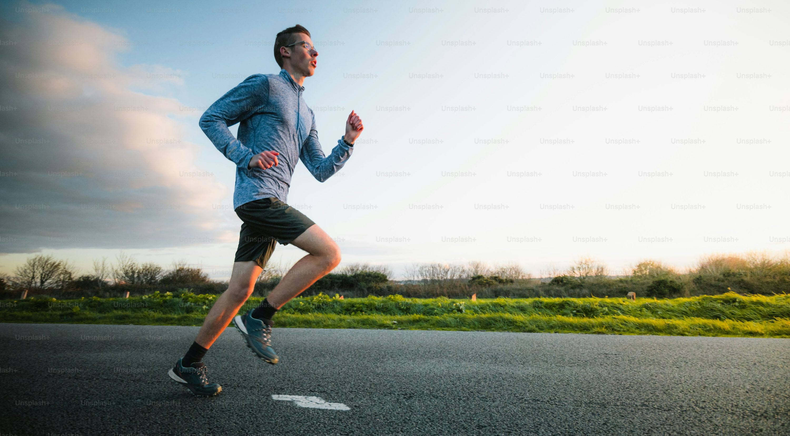

# Running Changed Me.

## Brief Summary

From a retired sports hobbyist to keyboard junkie in the twenties, while trying to get back I found a new passion that I truly enjoyed "Running".

## How it Started

Back in September 2023, I felt like it was the time to start being fit. My jeans & pants became tight around the waist, and most importantly my back started to hurt from the work office which I spent hours doing. As I got older all of this sitting started to add up.

I had nothing in my mind at the start, just run as fast as I can whenever I had free time. I barley could complete 1 Km without feeling like my lungs & heart gonna explode. It was frustrating but it felt somewhat nice... I was like the Flash during the runs.

Eventually after weeks of repeating the same my stamina got better, and I could complete a few laps around the block. But I don't know the exact pace, distance or heart rate. It was all by feel.

As a month passed by, the discipline began forming I understood that if I let excuses slide, this would affect me not in just running but my life. Procrastination & avoidance is addictive and hard to overcome in so many aspects in life. I would make any excuses to not do a lot of things.

Learning a  web framework?.. maybe when I have the time.  
Eating healthier? Maybe next week once I grab fast food.  
...   
it does not stop.

So I subscribed to a meal plans, ate less fast food. This helped my ton in saving time in my day to do other stuff. In return, my body felt better when running and in general.

## Plot Thickens

Decided to race for the first time which is a 10Km race run titled "The Factory". The funny part is I didn't ran a 10Km distance during any of my training. I didn't even know how to train for running, just run as fast as you can and farther.

<!-- See my the factory 10km race -->
<!-- will be different blog -->

## What's Up Now

As of now I am 

## Next Steps / Life Goals

- Half and Full Marathon before entering my 30's.
- Faster timings.
- Better fitness levels (Calisthenics/ Strength Training)

But with everything these things will take time, and should be taken carefully to avoid injuries and burnout